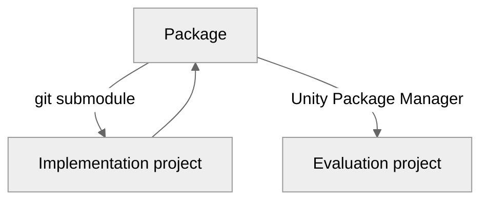

This document provides guidance for XR Collaboratory students and staff on how to develop custom packages for Unity.

### Prerequisites
Before you start, make sure to read through the following:
* [Creating custom Unity packages](https://docs.unity3d.com/Manual/CustomPackages.html) (including subsections)
* [Git submodules](https://git-scm.com/book/en/v2/Git-Tools-Submodules)
* [XRC Code Style](https://github.com/xrcollaboratory/xrc-toolkit/wiki/Code-style)

# Repositories
The development process requires three separate repositories; one containing the actual package, and two additional repositories that are Unity projects used for implementing and evaluating the package.



| Repository             | Description                                                                                                                                 |
|------------------------|---------------------------------------------------------------------------------------------------------------------------------------------|
| Implementation project | Unity project that contains the package under development as a git submodule.                                                               |
| Evaluation project     | Unity project used to evaluate the package by consuming it through the Unity package manager.                                               |
| Package                | Custom Unity package (UPM format) containing your package code and samples. You will add this to the implementation project as a submodule. |


* Course students: If you are developing packages as homework assignments in XRC courses, then each assignment will be its own package, but you will use the same implementation and evaluation projects throughout the semester.

* Independent research students: The link to the naming spreadsheet and the GitHub Classroom are provided separately on Canvas.

The following sections provide a walkthrough on how to set up and configure the project repositories, as well as how to get started with implementation and evaluation.

# 1. Project setup

If you are setting up your package development environment for the first time, you must create and configure your implementation and evaluation project repositories. If you have previously completed this process, you can jump to _Package setup_.

Follow the steps below to set up your implementation and evaluation project repositories.

## 1.1 Create the project repositories

* **Students**
    * Follow the GitHub Classroom links provided on Canvas to create **_both_** the implementation and evaluation project repositories
      * Independent research students: You must set your GitHub team name according to the naming spreadsheet on Canvas
    * Clone the implementation and evaluation project repositories to your local development machine

* <details>
    <summary>Staff</summary>

    * Create a new **implementation project** repository from the _xrc-project-template_ template repository on the `xrcollaboratory` GitHub organization
      * This repository should be named `xrc-implementation-<your last name in lower case>-<your netid in lower case>`
      * Example: `xrc-implementation-doe-jd123`
    * Create a new **evaluation project** repository from the _xrc-project-template_ template repository on the `xrcollaboratory` GitHub organization
      * This repository should be named `xrc-evaluation-<your last name in lower case>-<your netid in lower case>`
      * Example: `xrc-evaluation-doe-jd123`
  </details>

* <details>
    <summary>Collaborators</summary>
  
    * If you haven't already, make sure to fork the _xrc-project-template_ repository to your own GitHub organization. You should have access to the repository after being added as a collaborator.
    * Create a new **implementation project** repository from the _xrc-project-template_ template fork repository in your GitHub organization
        * You can follow your own naming convention, or adapt the XRC guidelines (for example by replacing 'xrc' with your group's identifier):
            * This repository should be named `xrc-implementation-<your last name in lower case>-<your netid in lower case>`
            * Example: `xrc-implementation-doe-jd123`
    * Create a new **evaluation project** repository from the _xrc-project-template_ fork repository in your GitHub organization
        * You can follow your own naming convention, or adapt the XRC guidelines (for example by replacing 'xrc' with your group's identifier):
          * This repository should be named `xrc-evaluation-<your last name in lower case>-<your netid in lower case>`
          * Example: `xrc-evaluation-doe-jd123`
    </details>

## 1.2 Import starter packages and samples
Install the following packages and samples, if not already in your projects. You must import these into both the implementation project and the evaluation project.

### Unity packages
* Package: **XR Interaction Toolkit**
  * Sample: Starter Assets
  * Sample: XR Device Simulator
* Package: **Input System**
  * No samples needed

### XRC packages
* Package: **XRC Core**
  * Sample: XRC Starter Assets
  * Instructions: https://xrcollaboratory.github.io/edu.cornell.xrc.toolkit.core
  * This package contains useful starter assets specifically for XRC projects as well as core definitions for the XRC package ecosystem


# 2. Package setup

After setting up and configuring your implementation and evaluation projects, you can add a package as a submodule to your implementation project.

You can have multiple packages as submodules in your implementation project, for example if working on several package homework assignments throughout a semester. Simply repeat the steps below for each package.

## 2.1. Create the package repository

* **Students**
    * Follow the GitHub Classroom link provided on Canvas to create your package repository
      * Course students: Each assignment will have a separate GitHub Classroom link. You simply click the link for each assignment and accept it; a repository will be created for you.
      * Independent research students: You must set your GitHub team name according to the naming spreadsheet

* <details>
    <summary>Staff</summary>

    * Create a new repository from the _xrc-package-template_ template repository on the `xrcollaboratory` GitHub organization
    * The repository name should follow the regular XRC package guidelines, such as `edu.cornell.xrc.toolkit.<name>`
  </details>

* <details>
    <summary>Collaborators</summary>

  * If you haven't already, make sure to fork the _xrc-package-template_ repository to your own GitHub organization. You should have access to the repository after being added as a collaborator.
  * Create a new repository from the _xrc-package-template_ fork repository in your GitHub organization
  * You can follow your own naming convention, or adapt the XRC guidelines (for example by replacing 'xrc' with your group's identifier):
    * The repository name should follow the regular XRC package guidelines, such as `edu.cornell.xrc.toolkit.<name>`
  </details>
  
  Set up a branch for documentation on GitHub:
  
    * On your package repository, on GitHub.com, go to **Settings > Pages**. Under _Build and deployment_ select GitHub Actions as the source.  
  * Note: If you don't see the Settings tab, notify the XRC Instructor who will update this for you.

## 2.2 Add git submodule

1. Add your package as a git submodule
    1. Open a terminal and navigate to the **Assets** folder in your implementation project
    2. Execute the following command `git submodule add <url to your package>`
        1. See more on git submodules here https://git-scm.com/book/en/v2/Git-Tools-Submodules
    3. You now have a **package folder**, as a git submodule, inside the Assets folder in your implementation project
2. Update the directory mappings for your implementation project in Rider
    1. Now that you have added the git submodule, you will need to configure Rider accordingly for your implementation project
        1. With your project open in Rider, go to
            * Windows: **File > Settings > Version Control > Directory Mappings**
            * macOS: **JetBrains Rider | Settings or Preferences | Version Control | Directory Mappings**
            * Add a new directory, pointing to the location of your package submodule, and set _VCS_ to Git.
            * Keep the directory marked as `<Project>` unchanged
        2. See more on Directory Mappings in Rider here https://www.jetbrains.com/help/rider/Settings_Version_Control_Directory_Mappings.html


## 2.3 Update `Samples~` folder

After adding the package as a submodule, your package now exists as a submodule within your implementation project. You will now make a few modifications within your package folder.

1. Add directory junction for `Samples~` inside your package folder
    1. The Unity package contains folders with the tilde symbol ~ . Such packages are not visible from within Unity, but we need to see the `Samples~` folder when developing in Unity. Open your package folder in a file explorer; **if it doesn't contain a `Samples~` folder, go ahead and create an empty one before proceeding to next step**.
    2. Open a terminal (command prompt in Windows) and execute the following command in the root of your package folder:
        1. Windows:
        ```
        mklink /J Samples Samples~
        ```
        2. macOS:
        ```
        ln -s Samples~ Samples
        ```
    3. You will now be able to see a folder named `Samples` from your Unity project, which is essentially a mapping to the actual `Samples~` folder.
    4. Note: In Rider you will now see two `Samples` folders in your Project Explorer. Make sure to work on the files contained in the folder marked with yellow letters.
    5. The resulting `Samples` folder should be ignored by the submodule version control. If you are using the provided template then this is already set up in the .gitignore file for your package.

## 2.4 Update package json files
Update the files listed below, found in your package folder. 
* Course students: Make sure to use the information provided for each assignment
* Independent research students: Make sure to use the information provided in the naming spreadsheet

 1. `package.json`
     * "name": Your package name
     * "displayName": Your package **display** name
     * "description": Add your package description
     * "documentationUrl": Your documentation URL
     * "changelogUrl": Your changelog URL
     * "licensesUrl": Your licenses URL
     * "repository": Update the URL with link to your repo, ending with ".git"
     * "samples": Update the entries according to your package samples. As you add more samples, you will have to update this entry.
 2. `Documentation~/docfx.json`
     * This file will be automatically updated when you push to GitHub, using the information in `package.json`. Do not edit manually.


# 3. Implementation

After adding the package, you can start implementing your package within the implementation project. Make sure to push the changes you make within the submodule to the package remote. 
All pushes to the `main` branch on the package repository will trigger the documentation workflow. 

For branching strategy, we recommend following the _GitHub Flow_ https://docs.github.com/en/get-started/quickstart/github-flow

## 3.1 Creating runtime scripts for packages
In your package:
* Add a folder named `Runtime`. This is where you will add your package scripts and configure the runtime assemblies. See the following links for more information:
  * Package layout: https://docs.unity3d.com/Manual/cus-layout.html
  * Assembly definitions: https://docs.unity3d.com/Manual/cus-asmdef.html

## 3.2 Creating samples for packages
* Follow the instructions provided by Unity for creating the sample files and modifying the package manifest: https://docs.unity3d.com/Manual/cus-samples.html
* In your implementation project, duplicate the sample scene (`XRC Starter Assets.unity`) from XRC Core and move to your package sample folder. Rename it according to your own package.
  * This will provide you with the standard XRC play area, XR origin setup, and ready-use-interactables.


# 4. Evaluation

The _evaluation_ project is where you will import your package and its samples through the Unity package manager. You will do this by installing your package from its Git URL, using the URL to your package repository. See more here: https://docs.unity3d.com/Manual/upm-ui-giturl.html

The evaluation project is where you confirm that the package works as intended when installed via the package manager.

All submissions (for homework, project milestones, final deliverables), must be built and run from your evaluation project, **not** your implementation project. 

# 5. Documentation

You can see a fully documented package here: _XRC Sphere Select_ https://xrcollaboratory.github.io/edu.cornell.xrc.toolkit.sphereselect

Your package should be documented as follows:
* ### Scripting API
  * You must carefully document all public class members in your code with XML comments
  * The scripting API is automatically generated based on your XML comments
  * See more on XML comments here: https://learn.microsoft.com/en-us/dotnet/csharp/language-reference/xmldoc/recommended-tags 
* ### Manual
  * The Manual pages; _Overview_, _Components_, and _Samples_ are automatically generated on push to GitHub, using XML comments and information in 'package.json'. These markdown files should not be edited manually.
  * Images: You will need to provide the following images:
    * Overview: `Documentation~/images/overview/replacewithyourpackagename.png` - such as `edu.cornell.xrc.toolkit.sphereselect.png`. This image appears at the top of Overview manual page.
    * Components: `Documentation~/images/components/replacewithyourcomponentname.png` - such as `SphereSelectLogic.png`. The filename must exactly match the component (class) name. Provide an image (screenshot) for all MonoBehaviour components in your package. The GitHub workflow will then take care of placing the images correctly on your components page.
    * Samples: `Documentation~/images/samples/yoursamplefoldername/anyimage.png` - such as `XRC Sphere Select/samplescreenshot.png`. All images within this folder (must be the same name as your actual samples folder) will be displayed on the Samples page.
  * Students: Additional documentation such as videos and reports may be required, based on your enrollment and project type. 

